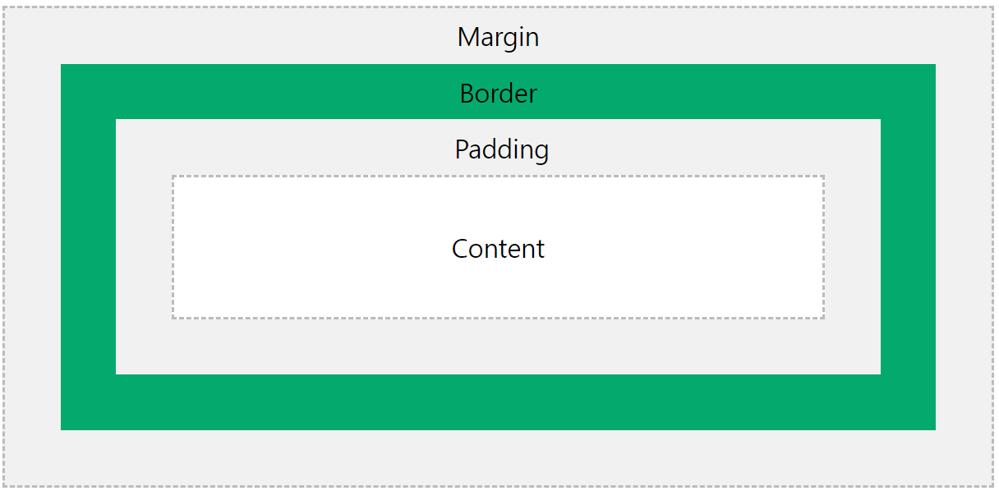

# 1) CSS 선언방법
## CSS의 구성
```css
span{
    color: red;
}
```
* span: selector
* color: property
* red: value


##  sytle을 HTML페이지에 적용하는 3가지 방법
* inline: HTML 태그 안에다 지정
* internal: head 안에 style 태그로 지정
* external: 외부파일로 지정

---

# 2) 상속과 우선순위 결정
## 상속
* 상위에서 적용한 스타일은 하위에도 반영됨
* width, height 등 box-model 속성은 상속되지 않음


## 우선순위
* inline > internal = external
* selector의 표현이 구체적인 것 먼저 적용
* id > class > element
* 뒤에 선언된 것

---
# 3) CSS Selector
## 3가지 selector
* tag로 지정
```css
span{
    color: red;
}
```
* id로 지정
```css
#spantag{
    color: red;
}
```
* class로 지정
```css
.spanClass{
    color: red;
}
```

## 요소선택과 자손선택
```html
<div id="jisu">
  <div>
    <span> span tag </span>
  </div>
  <span> span tag2 </span>
</div>
```
* 요소 선택(공백): 아래 모든 태그에 적용됨
```css
#jisu span { color : red }
```
모든 span 태그에 적용됨

* 자식 선택(>): 바로 하위 엘리먼트에만 적용됨
```css
#jisu > span { color : red }
```
span tag2에만 적용됨    
---

# 4) CSS 기본 Style 변경하기
## 폰트 색상 변경 방법
* color: red;
* color: rgba(255, 0, 0, 0.5);
* color: #ff0000;

## 폰트 사이즈 변경
* font-size: 16px;
* font-size: 1em;

## 배경색
* background-color

## 글씨체
* font-family: "Gulim";
* font-family: Gulim;
---

# 5) Element가 배치되는 방법(CSS layout)
엘리먼트는 위에서 아래로 배치되는 것이 기본이다


## display
* block: 블록을 가지고 쌓임
* inline: 우측으로 자리를 차지해감


## position
* static: 기본 속성, 순서대로 배치
* absolute: static 속성이 아닌 position을 기준으로 배치
* relative: 원래 위치해야 할 곳(블럭이 쌓인 곳)을 기준으로 배치
* fixed: viewport 좌측 상단을 기준으로 배치


## margin
* 위/아래/좌/우 엘리먼트와 본인간의 관계

## float
* 원래 flow에서 벗어날 수 있어 자유롭게 배치 가능


## box-model

* 블록 엘리먼트는 box에 관한 속성으로 배치를 추가 결정
* 기본적으로 부모의 크기를 가짐(width: 100%)
* width 등은 기본적으로 content의 크기임, %와 px로 조절가능
* box-sizing: 박스의 width 속성등의 기준
    * content-box: content의 크기가 유지됨
    * border-box: border의 크기가 유지됨
---

# 6) float 기반 샘플 화면 레이아웃 구성
# 7) 디버깅-HTML-CSS